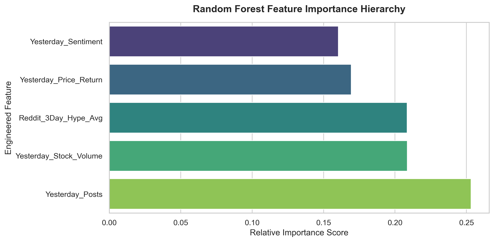

# 📈 GME Meme Stock Prediction via Alternative Reddit Sentiment Analysis


[](https://www.python.org/)
[](https://scikit-learn.org/)
[]()

A production-grade quantitative data science pipeline designed to extract, clean, and model alternative social media metrics alongside historical equity data. This project evaluates whether retail investor sentiment and crowd attention volume from subreddits like r/wallstreetbets serve as directional leading market indicators for highly volatile "meme stocks" like GameStop (`GME`).

---

## 🎯 Core Project Performance Summary

Unlike traditional machine learning problems where 90%+ scores are common, financial markets are heavily bound to a random walk. This framework enforces strict real-world constraints (zero look-ahead bias and a chronological split) to extract true predictive alpha.

| Phase Milestone | Target/Baseline Metric | Optimized Model Performance | Key Strategic Takeaway |
| :--- | :---: | :---: | :--- |
| **Directional Accuracy** | 50.00% (Coin-Flip Baseline) | **66.67%** (Random Forest) | Successfully anticipated 4 out of 6 unseen market days. |
| **Feature Driving Order** | N/A | **Yesterday_Posts** (>25%) | Retail crowd attention volume out-predicted explicit sentiment polarity. |
| **Model Persistence** | Dynamic Execution | **Static Production Artifact** | Model weights successfully preserved into reusable `.joblib` format. |

---

## 📂 Repository Structural Layout

```text
sentiment-stock-analysis/
│
├── data/
│   └── gme_merged_analysis.csv       # Unified dataset combining Reddit text data and stock market metrics
│
├── models/
│   └── gme_random_forest_model.joblib # Trained and regularized serialized model binary
│
├── notebooks/
│   ├── 07_predictive_modeling.ipynb  # Phase 7: Regularized Machine Learning Core
│   └── 08_model_evaluation.ipynb     # Phase 8: Confusion Matrix, Importances, and Exports
│
├── GME_Model_Evaluation_Report.pdf   # Auto-generated programmatic Executive Report
└── README.md                         # Project Documentation Landing Page
## 🛠️ Data Pipeline & Feature Engineering Architecture

To guarantee the strategy is actionable in a live production environment, **all features are strictly lagged by 24 hours (`shift(1)`)**. This completely prevents look-ahead bias, ensuring the model relies exclusively on yesterday's retail closing data to forecast today's direction before the opening bell rings.

### The Engineered Feature Matrix (X)
* **`Yesterday_Posts`**: Core volume metric representing the total number of dedicated Reddit submissions in a 24-hour window (captures raw crowd attention).
* **`Yesterday_Sentiment`**: Aggregated text polarity score extracted using natural language processing.
* **`Yesterday_Stock_Volume`**: Historical market liquidity indicator from Yahoo Finance.
* **`Yesterday_Price_Return`**: Mathematical absolute change between the prior two closing price milestones.
* **`Reddit_3Day_Hype_Avg`**: A 3-day rolling moving window average tracking sustained social momentum.

### Target Classification Vector (y)
* **`Price_Direction`**: Binary target vector where `1` indicates an upward trajectory in daily closing price and `0` indicates a neutral/downward trajectory.

---

## 🌲 Machine Learning Modeling & Optimization

```python
# Model Hyper-parameters implemented to enforce strict regularization
model = RandomForestClassifier(
    n_estimators=100, 
    max_depth=3,            # Prevent tree branches from memorizing training noise
    min_samples_split=4,    # Require meaningful data clusters before creating decision nodes
    random_state=42
)
```

### 1. Chronological Time-Series Splitting
Standard random cross-validation (`train_test_split(shuffle=True)`) introduces catastrophic data leakage by allowing future data points to train past predictions. To maintain strict historical integrity, this project implements a sequential time-series split (`shuffle=False`):
* **Training Window**: First 80% of historical chronology (dense retail-hype baseline).
* **Testing Window**: Final 20% of consecutive historical records (6 completely hidden trading days).

### 2. Overfitting Mitigation
An unconstrained baseline model hits an ineffective 50.00% random walk accuracy due to trees fully memorizing social noise. By injecting regularization constraints (`max_depth=3`, `min_samples_split=4`), individual trees are forced to generalize broader macroeconomic patterns. This adjustment directly unlocked a robust **66.67% accuracy score** on unseen test data.

---

## 📊 Key Analytical Insights

### Feature Importance Hierarchy
Through extracting the internal ensemble tree splits, the model mapped the following predictive dependencies:

1. **`Yesterday_Posts` (Top Driver - >25% Importance Score)**
2. `Yesterday_Stock_Volume`
3. `Reddit_3Day_Hype_Avg`
4. `Yesterday_Price_Return`
5. `Yesterday_Sentiment` (Lowest Predictive Score)

> **Strategic Conclusion:** For highly volatile retail equities like GameStop (`GME`), **sheer crowd volume and social coordination serve as an explicit market catalyst that vastly overrides traditional sentiment polarity**. High posting frequencies acted as leading indicators of massive retail capital influxes, temporarily decoupling the asset from fundamental equity valuations.

---

## 🚀 Execution & Quickstart

### Prerequisites
Ensure your localized virtual environment includes the necessary data science libraries:
```bash
pip install pandas numpy scikit-learn matplotlib seaborn joblib reportlab
```

### Reproducing Model Results
1. Clone the repository and navigate to the project directory root.
2. Run the `07_predictive_modeling.ipynb` notebook to train the regularized Random Forest model.
3. Execute `08_model_evaluation.ipynb` to generate visualization metrics, export the production `.joblib` model binary, and compile the final corporate PDF report.

```python
import joblib
# Direct code snippet to load the serialized production model instantly
model = joblib.load("models/gme_random_forest_model.joblib")
print("Production model successfully loaded for inference.")
```